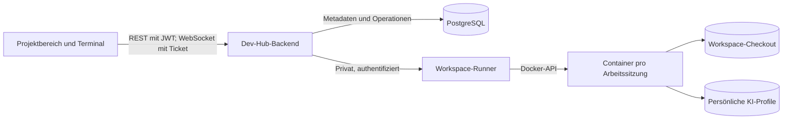

# Implementierungsplan: Remote Workspaces

Stand: 2026-09-30. Branch: `remote-workspaces`, Ausgangspunkt: `main` bei `9c3197bf1adab8fcbb3dd638d0e125e214fc249c` (Shared Projects zusammengeführt).

Status: Planungsentwurf. Dieser Commit enthält ausschließlich den Plan, keine Workspace-Implementierung. Bestehendes Docker-Environment und Commit/Push im Terminal sind mit dem Nutzer geklärt; die Aufbewahrung des Checkouts ist noch offen.

## 1. Ziel und erster Umfang

Die bereits beschriebene [Roadmap, Phase 7](PRODUCT_ROADMAP.md#phase-7-einzelner-remote-workspace) umsetzen: Ein verbundenes Repository isoliert auf einem Server bearbeiten, Shell/Claude CLI/Codex CLI im Browser bedienen, Änderungen committen und pushen und den Checkout anschließend kontrolliert entfernen. Persönliche KI-Logins bleiben über Arbeitssitzungen hinweg bestehen.

Vorgeschlagener erster Umfang:

- Ein aktiver Workspace je Nutzer und Projekt; mehrere Terminals darin, keine parallelen Agent-Worktrees.
- Start auf ausgewähltem vorhandenen Branch oder neuem Arbeitsbranch; Repository und Ausgangsrevision werden pro Workspace festgehalten.
- Browser-Terminal, Status, Branch, Ressourcenverbrauch, Stoppen, Fortsetzen und geprüftes Löschen.
- Claude- und Codex-Profile pro Nutzer; Profilwahl beim Terminalstart und Login im Terminal.
- Git-Status und Löschschutz im Browser; Commit/Push über Git im Terminal (vom Nutzer bestätigt).
- Ein gepflegtes Linux-Workspace-Image mit Git, Shell, tmux, Node 22, Java 25 und den beiden CLIs. Versionen beim Build festlegen; zusätzliche Toolchains nach tatsächlichem Bedarf.

Multi-Agent-Steuerung/Worktrees (Phase 8), gemeinsame Live-Terminals zwischen Nutzern, beliebige Devcontainer-Konfigurationen, öffentliche Vorschauports, SSH-Key-Verwaltung und ein vollständiger Browser-Codeeditor folgen später. Die erste Iteration nutzt HTTPS für GitHub/GitLab; generische Git-Hosts benötigen eine explizite spätere Freigabe samt Authentifizierungskonzept.

## 2. Bereits vorhanden und wiederverwendbar

| Bereich | Tatsächlicher Stand | Konsequenz |
| --- | --- | --- |
| Produktkonzept | [Roadmap](PRODUCT_ROADMAP.md), Kapitel 10 und Phase 7, beschreiben Isolation, Profile, Workspace-Rolle, Terminal und Bereinigung | Diese Festlegungen übernehmen |
| Nutzer/Projektrechte | [CurrentUser](backend/src/main/java/com/devhub/backend/security/CurrentUser.java), [ProjectAccessService](backend/src/main/java/com/devhub/backend/service/ProjectAccessService.java), OWNER/EDITOR/VIEWER | Workspace zusätzlich an ausführenden Nutzer und aktuelle Projektberechtigung binden |
| Git-Integration | Repository-Discovery/Metadaten und persönliche verschlüsselte PATs über [GitCredentialService](backend/src/main/java/com/devhub/backend/service/GitCredentialService.java) | Wiederverwenden, aber Clone/Fetch/Push und Runner-Zugang neu entwickeln |
| Git-URL-Erkennung | [RepositoryUrlParser](backend/src/main/java/com/devhub/backend/service/RepositoryUrlParser.java) | Metadatenparser ist keine ausreichende Validierung einer ausführbaren Clone-URL |
| Anmeldung | JWT mit Issuer/Audience-Prüfung, persönliche Daten, Keycloak-Realm | REST-Featureberechtigung und separate Ticket-Authentifizierung für WebSockets ergänzen |
| Projektoberfläche | [ProjectWorkspace](frontend/src/components/ProjectWorkspace.tsx) zeigt Inhalte und Kontext | Bestehender Name bezeichnet noch keine ausführbare Umgebung; Remote-Bereich ergänzen |
| Infrastruktur | [Produktions-Compose](deploy/docker-compose.yml), Traefik, Keycloak, PostgreSQL, GHCR/SSH-Deployment | Noch kein Runner, keine Workspace-Volumes und keine Terminal-Routen |
| Tests/CI | Backendtests, Frontendtests/Lint/Build, [CI](.github/workflows/ci.yml) | CI-Pushfilter enthält aktuell nur main/shared-projects; neuen Branch und Runner berücksichtigen |

Nicht vorhanden: Workspace-Datenmodell/API, Server-Agent, Containerverwaltung, PTY/WebSocket-Terminal, KI-Profilverwaltung oder ein ausführbarer Remote-Workspace.

Die Realm-Datei enthält aktuell nur `devhub-user` und `devhub-admin`; `devhub-workspace` muss hinzugefügt und im bestehenden Realm eingerichtet werden. Ein aktualisiertes Import-JSON allein aktualisiert keinen bereits laufenden Realm automatisch.

Die Deployment-Dokumentation enthält noch eine überholte Aussage über gemeinsame Nutzerdaten. Zusammen mit dem alten Single-User-Stand im Git-Konzept bei der Umsetzung an den tatsächlichen Mehrnutzerbetrieb anpassen.

## 3. Offene Entscheidungen

Drei Fragen wurden dem Nutzer gestellt. Q1 und Q3 sind wie unten beantwortet; Q2 bleibt ein ausdrücklich vorläufiger Vorschlag. Mit „Host“ ist der Server beziehungsweise die VM gemeint, auf dem Docker läuft.

| ID | Entscheidung | Stand / Festlegung | Einfluss |
| --- | --- | --- | --- |
| Q1 | Ausführungsort | Bestehendes Docker-Environment nutzen; kein zusätzlicher Server für die erste Iteration. CPU/RAM, freier Speicher und Quota-Möglichkeiten noch nicht geprüft | Runner-Service neben vorhandenen Diensten, getrennte Netzwerke und Ressourcenbudgets |
| Q2 | Verhalten beim Beenden und Aufbewahrung des Checkouts | Noch offen: vorgeschlagen Stoppen behält Arbeitsdateien; Löschen entfernt sie nach Prüfung. KI-Profile separat persistent | Volumes, Zustände, Fortsetzen und Bereinigungsregeln |
| Q3 | Erste Git-Oberfläche | Bestätigt: Commit/Push im Terminal, Git-Status und Löschschutz im Browser; Diff/Buttons später | Umfang und Reihenfolge der UI-Arbeit |

Weitere vorgeschlagene Defaults: OWNER und EDITOR dürfen eigene Workspaces starten; VIEWER nicht. Zusätzlich ist immer die Realm-Rolle erforderlich. Ein Nutzer bekommt keinen Zugriff auf Workspace, Terminal oder Zugangsdaten anderer Projektmitglieder, auch nicht als Projektowner. Projektzugriff ersetzt keine Berechtigung beim Git-Anbieter.

Ressourcenwerte nach Prüfung des vorhandenen Docker-Servers festlegen; Aufbewahrungswerte hängen von Q2 ab. Vorschlag für die lokale Entwicklung: 2 CPU, 4 GiB RAM, begrenzte Prozessanzahl und ein aktiver Workspace pro Nutzer. Echte Disk-Quoten erfordern eine geeignete Host-/Volume-Lösung; Docker-Volumes bieten diese nicht automatisch.

## 4. Architektur

- Backend: Projekt-/Nutzerberechtigungen, gewünschter Zustand, Operationen, Terminaltickets, Profilmetadaten und Auditereignisse. Kein Docker-Socket am App-Backend.
- Runner: Container/Volumes, Clone, Ressourcenprüfung, PTY-Anbindung, Git-Zustand und Bereinigung. Eigener Dienst unter `runner/`; vorgeschlagen TypeScript/Node 22 mit Docker-API, ohne zusätzliche native PTY-Bibliothek, sofern der Integrationsversuch das bestätigt.
- Terminal: Docker stellt das TTY bereit; tmux hält Shell-/CLI-Sitzungen bei Browser- oder Runner-Verbindungsabbrüchen im laufenden Container aufrecht. Stoppen beendet Prozesse; Fortsetzen erhält Dateien und Logins, nicht laufende Prozesse.
- App-Backend vermittelt die Terminalverbindung. Runner-Endpunkte sind nicht öffentlich erreichbar. Verbindung über ein dediziertes internes Docker-Netz mit überprüfter Dienstidentität. Nur das Backend erreicht die Runner-Steuerung; eine spätere Verlagerung auf einen separaten Server bleibt über die Schnittstelle möglich.
- Container laufen ohne Privilegien und Docker-Socket, als normaler Nutzer, mit begrenzten Ressourcen und ausschließlich den notwendigen Workspace-/Profil-Mounts. Keine frei übergebenen Images, Hostpfade oder Docker-Flags.
- Internetzugriff für Git, Paketregistries und KI-Anbieter bleibt möglich. Zugriffe auf App-Datenbank, internen Keycloak, Runner-Steuerung, Docker-Daemon und Host-/Cloud-Metadaten werden unterbunden. Docker-Netze und Host-Firewall-/Egress-Regeln für das vorhandene Environment konkret konfigurieren und testen.

Docker-Daemonzugriff des Runners ist eine starke Hostberechtigung. Für die erste Iteration verwaltet ausschließlich der Runner den bestehenden Docker-Daemon; Backend und Arbeitscontainer erhalten keinen Socket. Der Runner akzeptiert nur fest definierte Lifecycle-/Terminaloperationen, keine allgemeinen Docker-Requests. Arbeitscontainer hängen weder im bestehenden `edge`-Netz noch im Datenbanknetz. Diese Lösung teilt den Host-Kernel und ist keine VM-Isolation; Host-/Runner-Abschottung muss im realen Setup nachgewiesen werden. Ein separater Runner-Host ist eine spätere Ausbauoption, keine Voraussetzung dieser Planung.

### Daten und Zustände

Vorgeschlagen nächste freie Flyway-Migration, aktuell V8:

- `workspaces`: Nutzer, Projekt, stabile UUID, Repo-Snapshot, Ausgangsrevision, Branch, Runner-/Volume-Identität, gewünschter/beobachteter Zustand, Generation/Version, Aktivitätszeiten, Limits und Fehlercode.
- `workspace_operations`: idempotente Start-/Stop-/Löschoperationen, Retry-/Lease-Informationen und Ergebnis. Persistente Aufträge verhindern Ressourcenverlust bei Backend-Neustart.
- `ai_profiles`: Nutzer, Anbieter CLAUDE/CODEX, Name, stabile Profil-ID und Zeitstempel; keine Login-Dateien oder KI-Tokens.
- Kurzlebige Terminaltickets: atomar verbrauchbar, an Nutzer, Workspace, Terminal und Tokenablauf gebunden. Keine dauerhafte Speicherung des Bearer-Tokens.

Zustandsfolge: `PROVISIONING → RUNNING → STOPPING → STOPPED`; Fortsetzen über `PROVISIONING`, Löschen über `DELETING → DELETED`, Fehler mit nachvollziehbarem `ERROR`. Git-Prüfung ist ein eigener Befund, nicht mit dem Laufzeitzustand vermischt.

Start/Stop/Delete serialisieren; wiederholte Requests dürfen keine doppelten Container erzeugen. Runner gleicht nach Neustart gewünschte Zustände mit gelabelten tatsächlichen Ressourcen ab. Bei unbekanntem Zustand zuerst prüfen, nicht automatisch Daten entfernen. Aufträge übertragen explizite Nutzeridentität; requestgebundener `CurrentUser` darf nicht unbemerkt in Hintergrundjobs oder WebSocket-Callbacks weiterverwendet werden.

### API und Autorisierung

Vorgeschlagene Routen, endgültige DTOs im ersten Implementierungsschritt:

- `GET/POST /api/projects/{projectId}/workspaces`
- `GET /api/workspaces/{id}`; `POST .../start`, `.../stop`, `.../deletion-check`; `DELETE /api/workspaces/{id}`
- `GET .../git-status`, `.../resources`; `POST .../terminals`, `.../terminals/{terminalId}/ticket`
- `WS /api/workspaces/{id}/terminals/{terminalId}/connect`
- `GET/POST /api/ai-profiles`; `PATCH/DELETE /api/ai-profiles/{id}`

Jede Workspace-Operation verlangt eigenen Workspace, sichtbares Projekt, eigene Git-Berechtigung soweit nötig und `devhub-workspace`. Neue explizite Projektpermission `RUN_WORKSPACE` für OWNER/EDITOR, kein Ableiten von `MANAGE_REPOSITORY` (derzeit ausschließlich Owner).

WebSocket-Handshake benötigt eine eigene Spring-Security-Regel: Browser senden dort keinen Bearer-Header; ausschließlich ein erfolgreich validiertes Einmalticket authentifiziert die Verbindung. Ticketlaufzeit vorgeschlagen 30 Sekunden, strikte Origin-Prüfung und keine Tickets in Zugriffslogs. Authentifizierung von Backend zu Runner bleibt davon unabhängig.

Projektmitgliedschaft bei Operationen und bestehenden Verbindungen erneut prüfen; Entzug/Downgrade trennt Terminals und stoppt den Workspace ohne Löschen. JWT-Rollenänderungen sind beim jetzigen Modell spätestens nach Ablauf des fünfminütigen Tokens wirksam. Laufende Verbindungen müssen vor diesem Ablauf mit frischem JWT autorisiert oder geschlossen werden; kein unbegrenztes Terminal nach Login-/Rollenablauf. Kein Anspruch auf sofortige Keycloak-Rollenrevokation ohne zusätzlichen Mechanismus.

Projektlöschung nicht durch DB-Cascade an der Runner-Bereinigung vorbeiführen: aktive Workspaces blockieren die Löschung bis zum kontrollierten Abschluss. Entzugene Nutzerrechte rechtfertigen keine automatische Löschung von Arbeitsdateien. Archivierung und Änderung der Repository-Zuordnung müssen aktive Sessions berücksichtigen; ein bestehender Workspace bleibt an seinem Repo-Snapshot.

### Git und persönliche KI-Profile

- HTTPS-Clone nur von unterstützten konfigurierten Git-Hosts. URL, Ref, Pfad und Argumente separat validieren; keine Shell-Interpolation. Redirects und private Zieladressen nicht ungeprüft zulassen. Clone-/Fetch-Hooks und Credential-Weitergabe an fremde Remotes verhindern.
- Persönliche PATs wiederverwenden, niemals den Token des Projektowners für Mitglieder. Credentials nur an autorisierte Runner-Vorgänge übergeben; Helferzugriff kurzlebig und auf Nutzer/Workspace/Provider/Repository gebunden.
- PATs nicht in Clone-URLs, Argumentlisten, Shell-History, persistenter Git-Konfiguration oder Logs ablegen. Credential-Helper statt gespeicherter Tokendatei; nach Stop/Entzug keine weitere Ausgabe. Ein berechtigter Nutzer kann in seiner eigenen Shell seine Zugangsdaten verwenden; das ist keine zusätzliche Isolation gegenüber seinem eigenen Code.
- Read-only-PAT genügt nicht für Push. [SettingsView](frontend/src/components/SettingsView.tsx) und [Git-Konzept](GIT_INTEGRATION_KONZEPT.md) unterscheiden Lesescopes und optionalen Schreibzugriff: GitHub Contents read/write bzw. passende classic scopes, GitLab `write_repository`. Fine-grained Rechte nicht aus fehlenden Scope-Headern erraten; Upstream-Antworten verständlich anzeigen.
- Git-Commitidentität separat von KI-Profilen auswählen/konfigurieren. Kein automatischer Push oder Force-Push.
- Persistente KI-Dateien gemäß Roadmap unter `/data/users/{userId}/{provider}/{profileId}`: Verzeichnisse 0700, sensitive Dateien 0600; stabile servergenerierte IDs statt benutzerdefinierter Pfade. Container erhalten ausschließlich Profile ihres eigenen Nutzers.
- Beim Terminalstart `CLAUDE_CONFIG_DIR`/`CODEX_HOME` auf das gewählte eigene Profil setzen, inklusive tmux-Session-Umgebung. Profilwechsel eröffnet ein neues Terminal mit anderer Umgebung; aktive CLIs werden nicht durch Dateitausch umgestellt.
- Login läuft vollständig über `claude`/`/login` bzw. `codex login --device-auth`. Backend speichert nur Profilmetadaten. CLI-Verhalten, benötigte schreibbare Pfade und Browser-/Device-Login im realen Image prüfen.
- Mehrere Terminals mit demselben Profil: Unterstützung paralleler CLI-Dateizugriffe prüfen; andernfalls Profil-Lease und klare Fehlermeldung. Profil löschen nur ohne aktive Nutzung, explizit und getrennt vom Checkout. Backup/Restore, Rechte und Geheimnisschutz dokumentieren.

### Terminal, Löschschutz und Bereinigung

Frontend mit `@xterm/xterm` und Fit-Addon; Statuspolling, Resize, Unicode/Paste, begrenzte Puffer und Backpressure. Eine neue Ticketanforderung ermöglicht Reconnect. Terminalinhalt wird nicht automatisch als Produktlog gespeichert; Metadatenlogs enthalten keine Ein-/Ausgabe oder Geheimnisse.

Git-Prüfung umfasst staged/unstaged/untracked Dateien, Stashes, lokale Branches und abweichende/detached Commits. Remote-Zustand vor Freigabe aktualisieren und Erreichbarkeit der lokalen Commits aus Remote-Refs prüfen. Fehlende Upstreams, Auth-/Netzwerkfehler oder fehlendes/beschädigtes Git-Verzeichnis gelten als „nicht sicher prüfbar“, niemals als „sauber“.

Stoppen behält Daten. Vor Löschen alle Schreibprozesse stoppen, danach neu prüfen; Freigabe an unveränderte Workspace-Generation/Git-Prüfung binden, damit keine Änderung zwischen Prüfung und Löschung verloren geht. Ignorierte Dateien ebenfalls sichtbar berücksichtigen: Git-Push sichert sie nicht. Bewusstes Verwerfen verlangt eine explizite UI-Bestätigung mit konkreter Warnung. Keine automatische Löschung ungeprüfter Checkout-Daten.

Idle-/Maximallaufzeit beendet zunächst nur Compute. Ausgabe eines laufenden Agents und Prozessaktivität berücksichtigen; ein geschlossenes Browserfenster beendet keinen laufenden Auftrag sofort. Aufbewahrungsfrist separat konfigurieren. Automatische Bereinigung löscht nur nach erneuter Prüfung und festgelegter Policy; blockierte Fälle bleiben sichtbar. Profile sind von Checkout-TTL ausgenommen. Disk-Voll, Quotenüberschreitung und teilweise Bereinigung erhalten eigene Fehlerzustände.

## 5. Implementierungsreihenfolge und prüfbare Ergebnisse

| Schritt | Änderungen | Fertig, wenn |
| --- | --- | --- |
| 1. Verträge und Rechte | Bestätigte Q1/Q3 und offene Q2 festhalten; Feature-Schalter standardmäßig aus; Migration/DTOs/Zustände; RUN_WORKSPACE; Realm-Rolle; Runner-Schnittstelle mit Fake für Backendtests | Unberechtigte Nutzer, Viewer und fremde Workspace-/Profil-IDs werden abgewiesen; gleichzeitige Starts erzeugen nur eine Operation |
| 2. Runner und erste durchgängige Shell | `runner/`, Workspace-Image, private Dienstverbindung, Create/Start/Stop/Inspect/Resize; Clone und Limits; einfaches Terminal über Tickets | Repo lässt sich im Browser bearbeiten; Browser-Reconnect erhält Session; Stop/Start behält Dateien; Neustarts werden abgeglichen |
| 3. Persönlicher Git-Zugriff | Eigene Credential-Leases/Helper, Branchstart, Git-Identität, Scopehinweise und Fehlermeldungen | Private Repos mit eigenem Token klonbar; Commit/Push im Terminal funktionieren; fremde Remotes bekommen keinen Token |
| 4. KI-Profile | Profil-API, Settings, persistente Mounts, Auswahl beim Terminalstart, Claude/Codex | Login beider CLIs überlebt Container-Neuanlage; anderer Nutzer/anderes Profil erhält keine Login-Dateien |
| 5. Vollständige Projektoberfläche | Eigener Remote-Workspace-Bereich, Status/Operationen/Ressourcen, Terminals, Start/Stop/Resume; Git-Status und Löschprüfung; keine Diff-/Commit-/Push-Buttons in dieser Iteration | Lade-/Fehler-/Reconnect-Zustände sind bedienbar; das vorhandene Projekt- und Content-UI bleibt nutzbar |
| 6. Sicherer Abschluss | Git-Prüfung, Generation/Fencing, Löschdialog, Idle-/Retention-Jobs, Projektlöschung und Mitgliedschaftsentzug | Ungepushte/unbekannte Zustände blockieren automatische Löschung; kontrolliertes Entfernen räumt Container und Checkout auf |
| 7. Betrieb und Abnahme | Lokales Compose mit PostgreSQL/Runner, Runner-Service im vorhandenen Docker-Environment, Proxy/Realm-Setup, CI und Doku | Gesamter Ablauf und Fehlerfälle bestehen auf realem Docker/Linux sowie mit zwei Nutzern |

Schritte sind aufeinander aufbauende reviewbare Commits. Löschfunktionen bleiben bis Schritt 6 deaktiviert; frühe Runner-Schritte dürfen keine Checkout-TTL aktivieren. Erst vollständige Abnahme schaltet das Feature für berechtigte Nutzer frei.

## 6. Tests und Deployment

- Bestehende Checks: Backend `./gradlew test bootJar --no-daemon`; Frontend `npm ci`, Lint, Tests und Build. Runner zusätzlich Typecheck/Lint/Tests/Imagebuild.
- Backend mit Fake-Runner: Rollen und aktueller Projektzugriff, eigener Workspace, eigene Credentials/Profile, doppelte Starts, Retry/Neustart, Projektlöschung und Bereinigung. WebSocket-Ticket replay/expiry/wrong origin/wrong user sowie erneute Autorisierung testen.
- Runner-Integration auf Linux/Docker mit lokalen Test-Remotes ohne echte PATs: Clone/Commit/Push, Terminal-Reconnect/Resize, Container-Neuanlage mit Dateien/Profilen, Abbruch/Timeout, ungepushte andere Branches/Stashes, unbekannter Git-Zustand und Löschrennen.
- Ressourcen-/Isolationstest: CPU/RAM/Prozesslimits und tatsächliche Disk-Quota; kein Zugriff auf andere Nutzerprofile, Hostdateien, Docker und App-interne Dienste. Auch Symlinks in nutzerbeschreibbaren Checkout-/Profilpfaden berücksichtigen.
- Frontendtests für asynchrone Operationen, Berechtigungen, Profilwahl, Ticket-Erneuerung und Löschwarnungen; Browser-Abnahme für echtes PTY, Geräte-Login, Netzwerkabbrüche und lange laufende CLIs. Echte KI-Konten ausschließlich für manuelle Abnahme, keine Secrets in CI.
- Neue Migration mindestens einmal gegen PostgreSQL prüfen; bisherige H2-Tests ersetzen diesen Check nicht.
- [Vite](frontend/vite.config.ts) braucht `ws: true`; [nginx](frontend/nginx.conf) Upgrade/Connection-Header und passende Timeouts. Produktions-Traefik routet `/api` direkt zum Backend; diesen tatsächlichen WebSocket-Pfad zusätzlich prüfen.
- CI für `remote-workspaces` aktivieren und Runner-Tests ergänzen. Deploymentworkflow baut bislang ausschließlich Backend/Frontend; Runner-Image, Pfadfilter und Deployment separat ergänzen. Nicht ungeprüft denselben allgemeinen App-Deploy für Runner-Upgrades verwenden.
- Produktionsbetrieb nach Host-Ressourcenprüfung und Abnahme: private Runner-Verbindung, verwaltete Volumes/Quoten, Secrets, Keycloak-Rolle für ausgewählte Nutzer, Metriken, Backup/Restore und verifizierter WebSocket-Pfad.
- Rollback schaltet Starts ab und stoppt Compute, behält Checkout-/Profil-Volumes und Operationsdaten für Wiederherstellung. Keine Volumelöschung als Teil eines normalen Deployments.

## 7. Gesamtabnahme

Mit zwei Nutzern und einem geteilten Projekt: Owner/Editor mit Workspace-Rolle können je eine eigene Umgebung starten; Viewer und Nutzer ohne Rolle können es nicht. Ein privates Repo wird mit eigenen Credentials geklont, Shell und beide CLIs funktionieren, Login bleibt nach neuer Container-Sitzung erhalten, Browser-Reconnect verliert keine laufende Sitzung. Änderungen werden auf einen Arbeitsbranch gepusht und sichere Checkouts samt Container anschließend entfernt.

Ungepushte/uncommittete Änderungen, unerreichbare Remotes, Rollenentzug, Profilkonflikte und Backend-/Runner-Neustarts führen zu klaren Zuständen ohne automatische Löschung von Arbeitsdaten. Persönliche Profile bleiben beim normalen Workspace-Abschluss erhalten. Diese Abnahme umfasst mehr als grüne App-Unit-Tests; Docker- und Browserprüfung sind vor Merge erforderlich.
